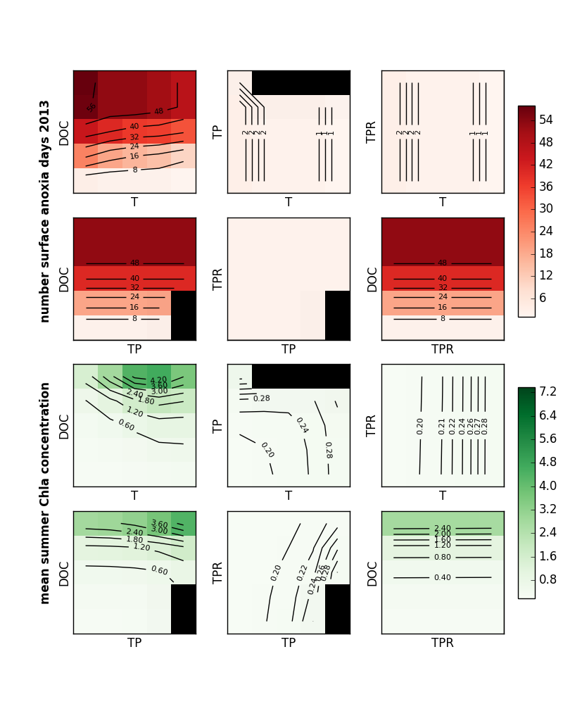

# How to run this simulation

1. Preparation. Review makeparameterdict.R and makeMLfiles.R and run
   them in that order.
1. Run response.surface.run.m in Matlab
1. Postprocessing files are in [postprocessing](postprocessing).

#Parameters

* Air temperature **T**
* Total P concentration **TP**
* TP linear reduction **TPR**
* DOC concentration **DOC**

Last three are controlled using runoff input to MyLake. This time
there's no change in MyLake parameters. 

## Levels

Level | Temperature | Total P | TP linear reduction | DOC
--- | --- | --- | --- | ---
1 | original - 2.5 | **original** | **Total P remains** | **original**
2 | **original**  | original * 3.16  | Total P diminishing to 77.5 % at the end | original * 3.16
3 | original + 2.5 | original * 10 | Total P diminishing to 55 % at the end | original * 10
4 | original + 5.0 | original * 31.6 | Total P diminishing to 32.5 % at the end | original * 31.6
5 | original + 7.5 | original * 100 | Total P diminishing to 10 % at the end | original * 100

(By the way Total P cannot be reduced to zero; hence 10 % at the end.)

## Failures
Temperature | Total P | TP linear reduction | DOC | Simulation ID
--- | --- | --- | --- | ---
2 | 5 | 1 | 1 | 22
3 | 5 | 1 | 1 | 23
4 | 5 | 1 | 1 | 24
5 | 5 | 1 | 1 | 25
2 | 5 | 2 | 1 | 47
3 | 5 | 2 | 1 | 48
4 | 5 | 2 | 1 | 49
5 | 5 | 2 | 1 | 50
3 | 5 | 3 | 1 | 73
4 | 5 | 3 | 1 | 74
5 | 5 | 3 | 1 | 75
3 | 5 | 4 | 1 | 98
4 | 5 | 4 | 1 | 99
5 | 5 | 4 | 1 | 100
4 | 5 | 5 | 1 | 124
5 | 5 | 5 | 1 | 125
2 | 5 | 1 | 2 | 147
3 | 5 | 1 | 2 | 148
4 | 5 | 1 | 2 | 149
5 | 5 | 1 | 2 | 150
4 | 5 | 2 | 2 | 174
5 | 5 | 2 | 2 | 175
5 | 5 | 3 | 2 | 200

# Responses

* Water temperature
* Chl concentration
* Total P concentration
* O2 saturation (absolute)

## Primary comparison

* Maximum Chl concentration on surface in 2013 **R1**
* Number of surface anoxia days (abs < 0.01) in 2013 **R2**

# Tentative results

