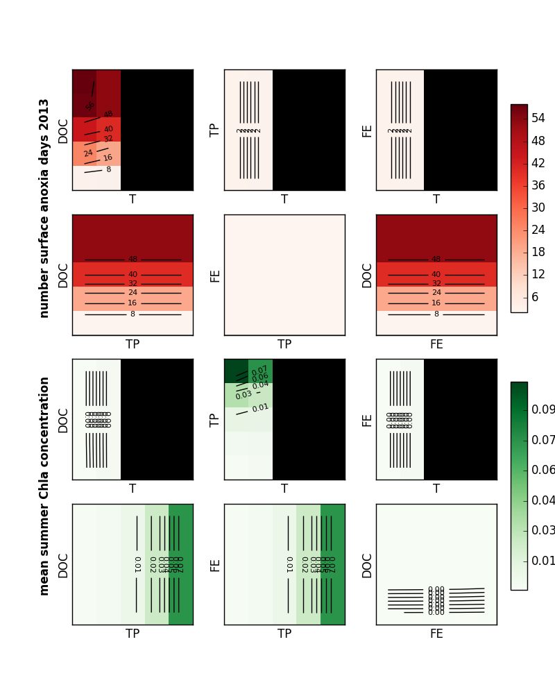
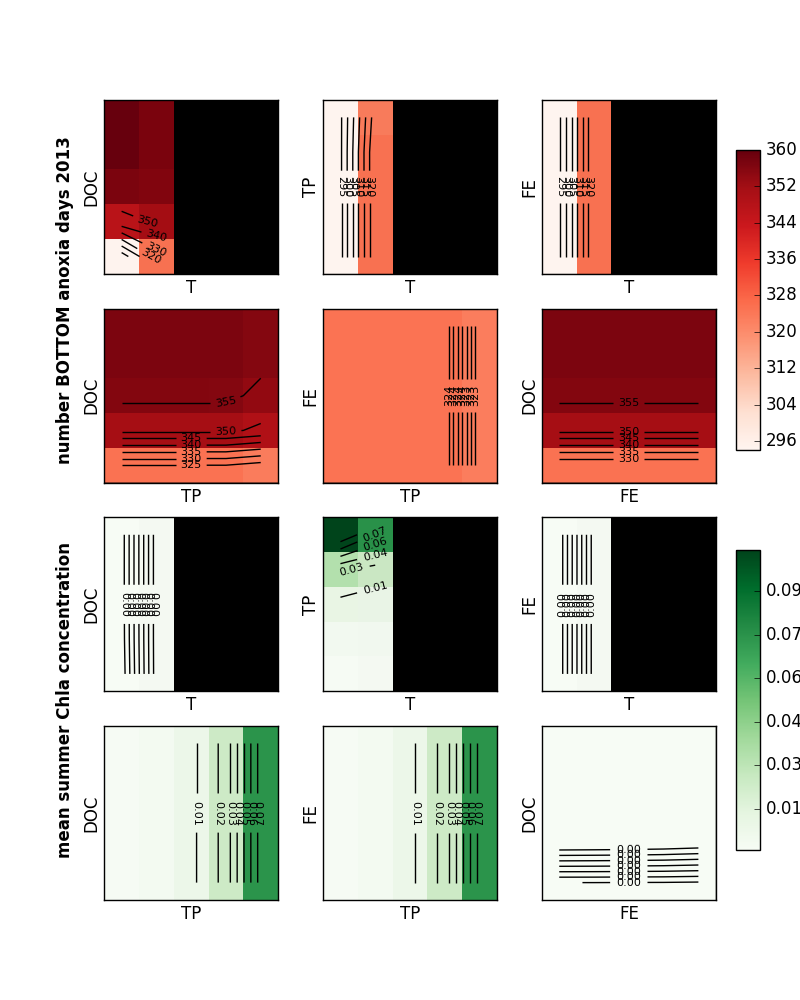

# How to run this simulation

1. Preparation. Review makeparameterdict.R and makeMLfiles.R and run
   them in that order.
1. Run response.surface.run.m in Matlab
1. Postprocessing files are in [postprocessing](postprocessing).

# Checking results using the July verions

#Parameters

* Air temperature **T**
* Total P concentration **TP**
* Fe3+ concentration **FE**
* DOC concentration **DOC**

Last three are controlled using runoff input to MyLake. This time
there's no change in MyLake parameters. 

## Levels

Level | Temperature | Total P | Fe3+ | DOC
--- | --- | --- | --- | ---
1 | original - 2.5 | **original** | **zero** | **original**
2 | **original**  | original * 1.58  | 0.5 | original * 3.16
3 | original + 2.5 | original * 5.0 | 1.0 | original * 10
4 | original + 5.0 | original * 15.8 | 2.0 | original * 31.6
5 | original + 7.5 | original * 50 | 4.0 | original * 100

### Observation

* No more model crashes, probably because of reduced TP
* Fe didn't seem to affect the results -- did I do something wrong?

# Responses

* Water temperature
* Chl concentration
* Total P concentration
* O2 saturation (absolute)

## Primary comparison

* Maximum Chl concentration on surface in 2013 **R1**
* Number of surface anoxia days (abs < 0.01) in 2013 **R2**

# Tentative results

Note that only two dimensions are varied and the other two are
fixed. They are fixed at **original** state. See Parameters above.

 

With the bottom anoxia instead of surface anoxia:

 

