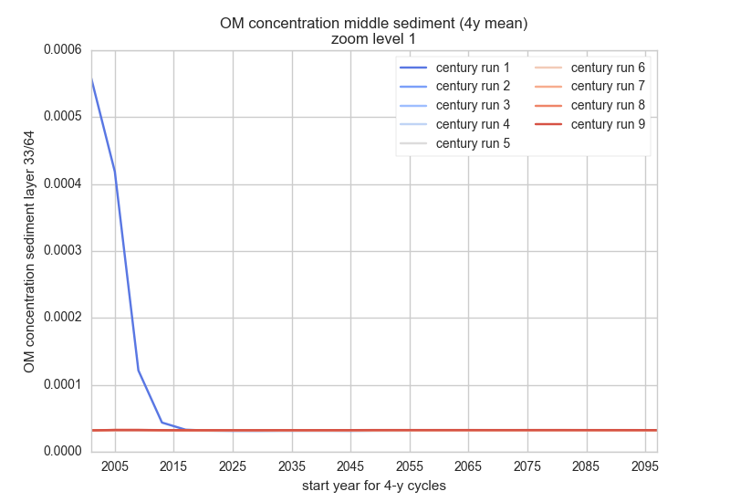
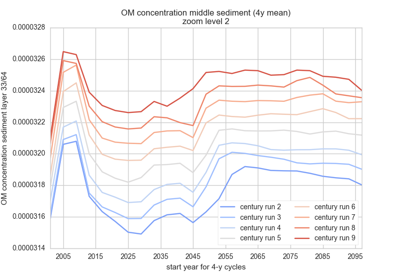

## OM concentration sediment top (3 levels of zoom, same data) 

 
 
 

1. Century run 0's OM spike in in the beginning is not an issue (part of initialisation work)
2. Later centuries seem to stabilise at a higher concentration (the magnitude is small). I have no idea why this happens.
3. The apparent stabilisation may not be the end stabilisation due to jumps around 2030s and 2040s. I have no idea why this is about the same timing. 
4. The jump around 2030s and 2040s becomes earlier and earlier. I also don't know why. 
5. As with many other state variables the connection from the preceding century is not well done; we see a spike at the beginning. I still do not know what variable I have not managed to liaise.

The results seem too misterious on too many levels. It's kind of creepy. Is it possible many of these issues are numerical artefacts?

## OM concentration sediment MIDDLE (3 levels of zoom, same data) 

 
 
 

Generally the same observation. Perhaps I do feel more for the numerical artefact possibility, except that I do not know why there's a clear gradient on century-runs. 
