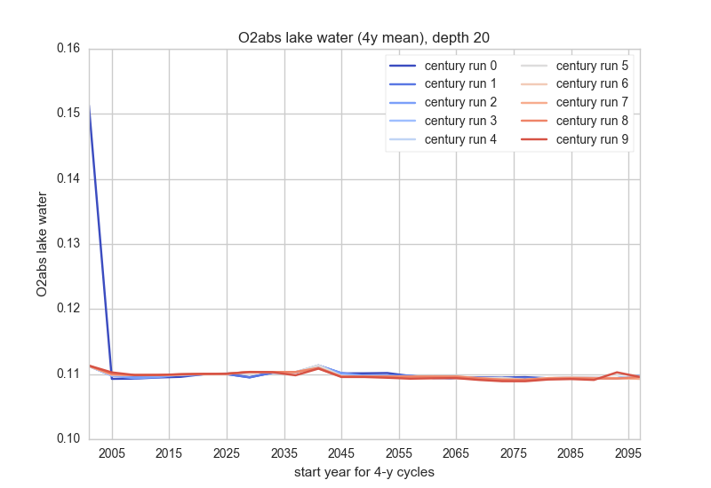
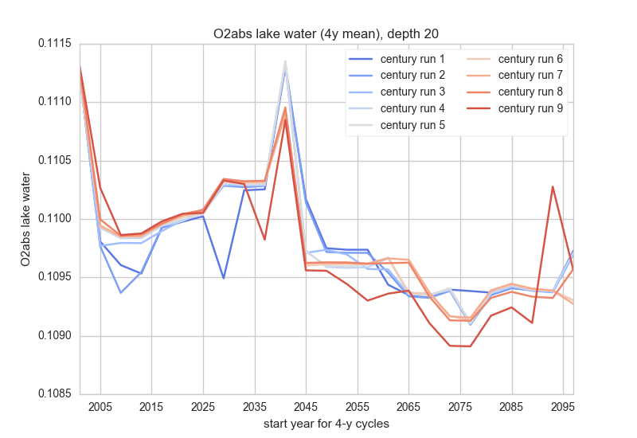

# O2abs lake water, depth 00 (2 levels of zoom, same data) 

 
 

# O2abs lake water, depth 10 (2 levels of zoom, same data) 

 
 

# O2abs lake water, depth 20 (2 levels of zoom, same data) 

 
 

# O2abs lake water, depth 40 (2 levels of zoom, same data) 

 
 

# O2abs lake water, depth 60 (2 levels of zoom, same data) 

 
 

# O2abs lake water, depth 80 (2 levels of zoom, same data) 

 
 

