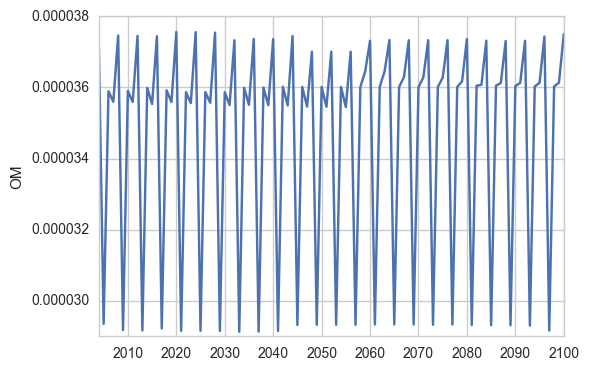
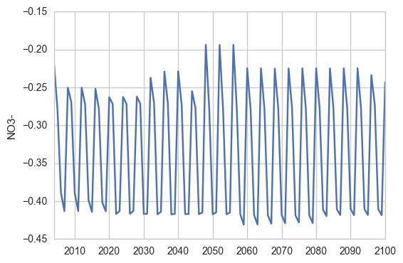
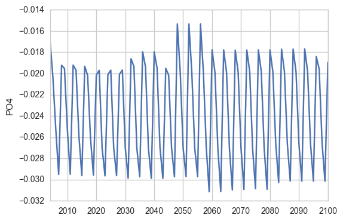
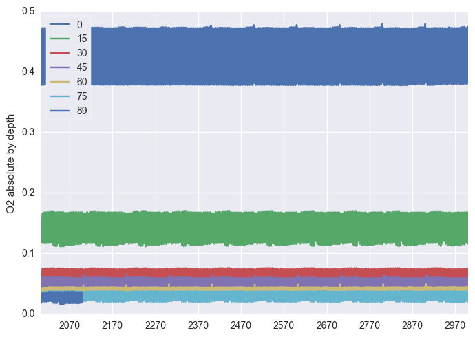
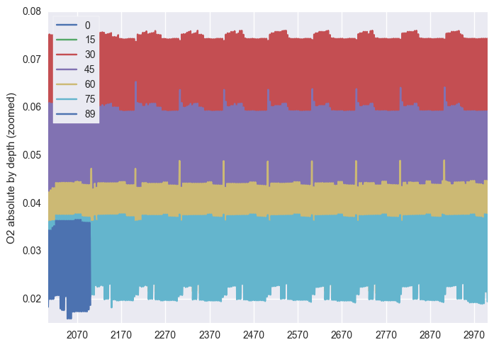
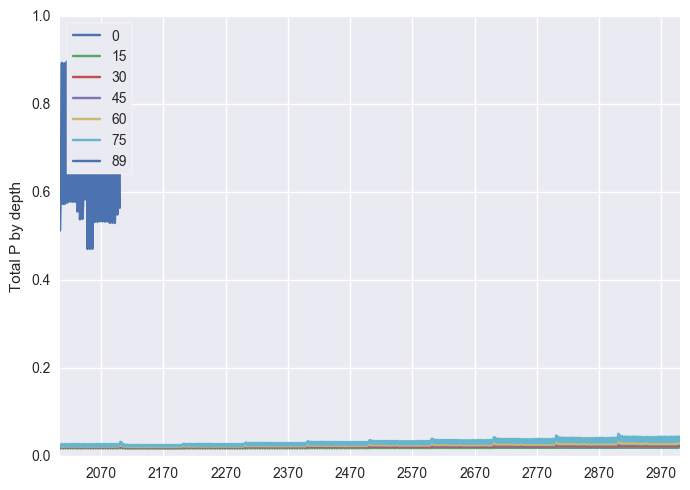

# Setup 

- The original input for 2010-01-01 to 2013-12-31 (i.e., 4 years) was
  repeated 25 times -- set as if it covers the whole 21st century.
- Hopefully, it gives enough stochasticity in meteorological inputs
  and yet a 'stable' weather condition.
- Stream inputs need to be improved. Specifically I need to set a good
  typical concentrations for all elements and chemical species. 

# Results (Calendar year means, i.e., 100 means)

# Sediment fluxes (positive into sediments)

 
 
 
3.png)

3.png) 

 

 

## Water concentrations

 
 
 
 
 
 

# Where to go from here

- Running autocorrelation? Can be done already
- Longer centuries (anyway do we agree that 100 years was not long
  enough?)
- Need to pour in Fe and other elements
