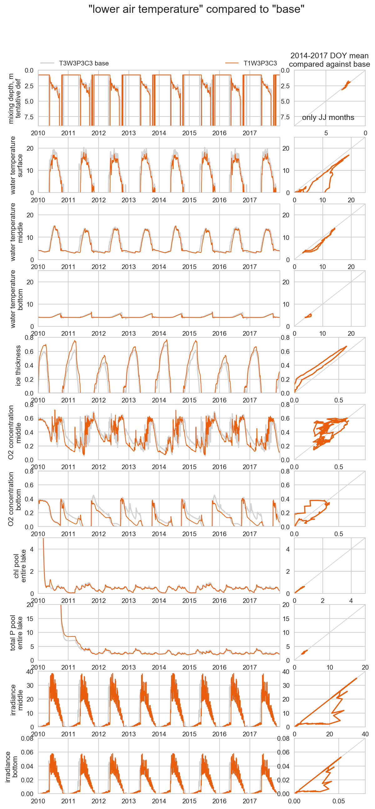
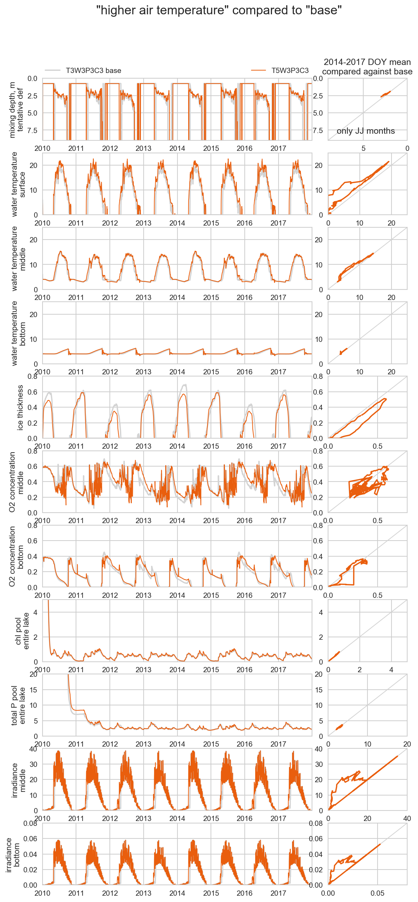
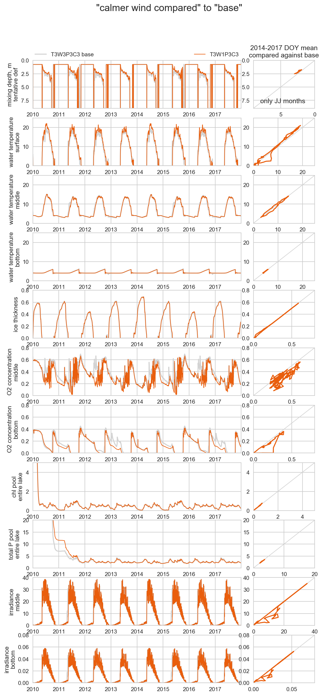
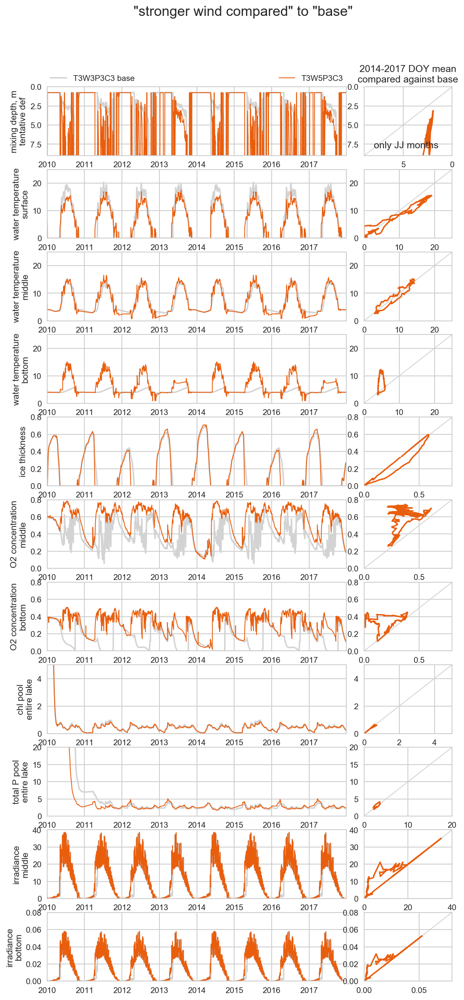
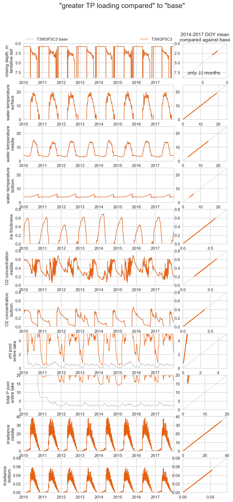
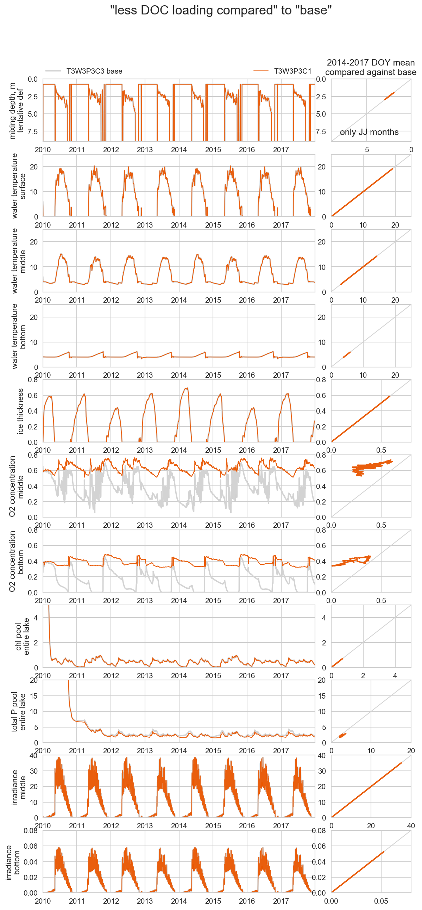
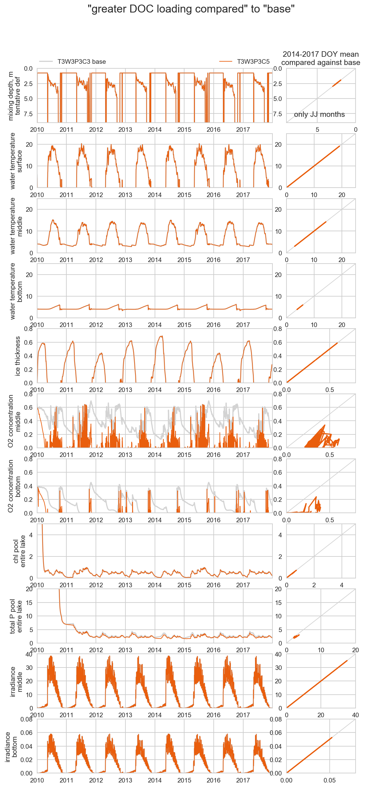
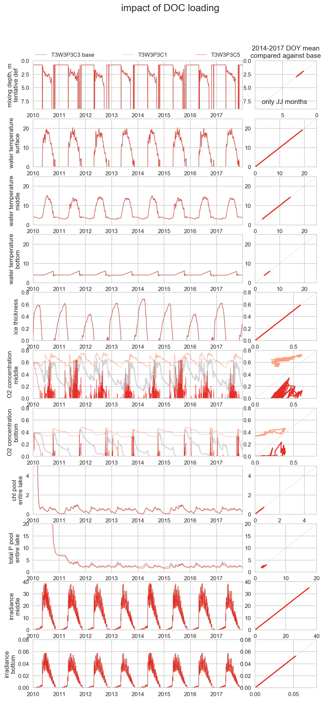
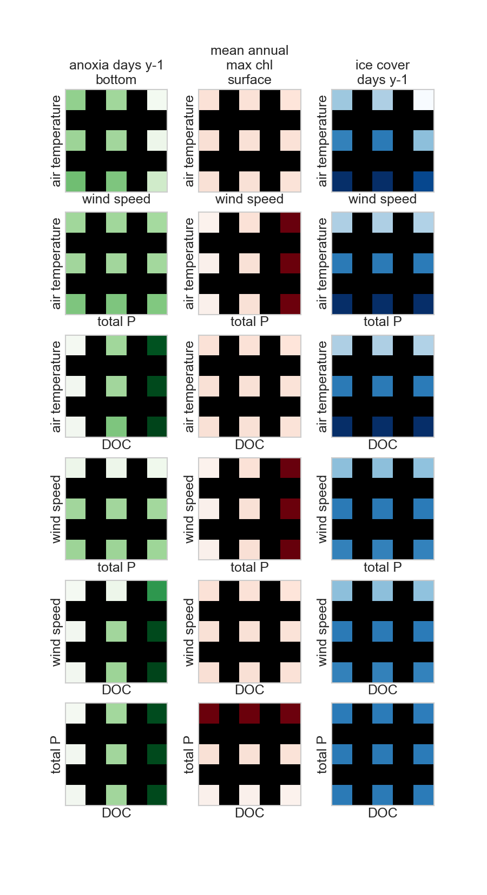

# How to run this simulation

1. Preparation. Review makeparameterdict.R and makeMLfiles.R and run
   them in that order. Optionally run the batch files.
1. Run response.surface.run.m in Matlab
1. Postprocessing files are in [postprocessing](postprocessing).

#Parameters

* Air temperature **T**
* Wind speed **W**
* Total P concentration **TP**
* DOC concentration **DOC**

## Levels

Temperature variation is on the lower end because of failing at high
temperature levels in simulation number 06. 

Level | Temperature | Wind speed | Total P | DOC
--- | --- | --- | --- | ---
1 | original - 3.0 | original * 0.25 | original * 0.33 | original * 0.0316 
2 | original - 1.0 | original * 0.50 | original | original * 0.010
3 | **original** | **original** | **original * 3.0** |  **original * 0.316** 
4 | original + 1.0 | original * 2.0 | original * 9.0 | original * 1.00
5 | original + 3.0 | original * 4.0 | original * 27 | original * 3.16

# Responses

* something about water temperature / ice
* something about oxygen / anoxia
* something about light / colour
* something about algae bloom

## model crashes

None this time

# Raw outputs

## impact of **T**

 
 
 
 

## impact of **WS**

 
 
 
 

## impact of **TP**

 
 
 
 

## impact of **DOC**

 
 
 
 

## Response surfaces

# old TODO

- make wind speed milder
- find good air temperature levels that work
- calculate and report the following variables
  - something about light
  - something about temerature profile, phenology of stratification
  - try other definitions of anoxia and algal bloom
- increase the resolution (?)
- set up the NIVA server workflow 
- confirm the following
  - time span seems fine (2010-2013 input repeated twice, use the
    2014-2017 for reporting)
  - we keep total P as a dimension. Total P seems to affect only the P scaling (?)
    and that might mean it's not 

# new TODO

- more response surfaces (more columns)
