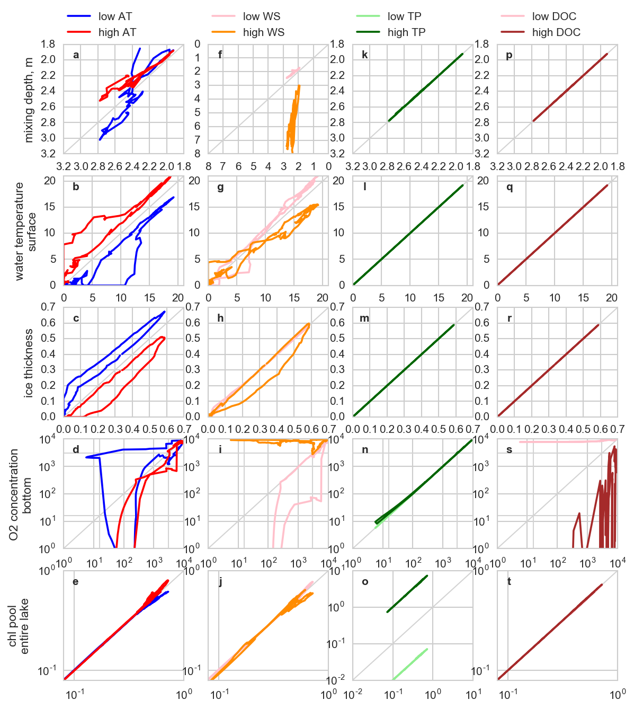
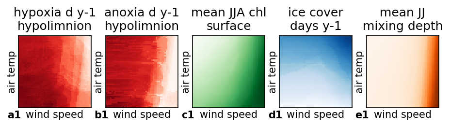

# How to run this simulation

1. Preparation. Review **makeparameterdict.R** and **makeMLfiles.R** and run
   them in that order. This will populate the input files and create
   directories for the outputs.
1. Run **makebatch.py**. This will create batch .m files.
1. Run the batch files made in the previous steps. Use Raoul's
   **launch\_24\_batch.m** if appropriate.
1. Postprocessing files are in [postprocessing](postprocessing). Run
   **pp.py** and **sim_specific.py** in the
   directory. **inputs_ts.py** creates time series graphs.

# What's new in Simulation 10

* Uses Igor's late February versions, except:
  * `dz = 0.5`
  * Ice output `His` outputs
* Dimensions 9 by 9 by 9 by 9
  * With the base reference to be at level 5 for all 4 dimensions
    (AT5 WS5 TP5 DOC5, see below)
  * This base reference is not the original Langtjern weather, see
    table below

# Design

* Inputs taken from real Langtjern weather
  * With base being modified
  * All levels also modification of the original
  * 4 years (2010-2013)
* Simulation lasts 8 years (2010-2017)
  * Repeats first 4 years twice
  * Use the last 4 years (2014-2017) for reporting purpose
  * Does that mean that water-sediment is in quasi steady state?
    * Water part seem fine (short residence time ? days)
	* Still don't know if the sediment is (and will ever be) in steady
      state with water
	* Basically not tested but beyond our scope this time...?
* The levels control the scale of the inputs, called **dimensions**
  * Air temperature **AT**
  * Wind speed **WS**
  * Total P concentration **TP**
  * DOC concentration **DOC**
* The levels (1 though 9) are chosen so that
  * At the extremes the inputs are almost unrealistic but still
    interesting, and the model does not crash
  * At the base (5), the **responses** are about at the middle in
    scale
	  * Makes sure that when keeping 3 dimensions at the base level 5,
        we can maximise the contrast (dynamic range) of the last
        dimension. For example, with levels AT1-AT9 but fixing WS5 TP5
        DOC5, none of the last three (WS5, TP5, DOC5) should not
        dominate how AT1-9 plays a role if any.

## Levels

Level | Air Temp   | Wind Speed       | Total P             | DOC
--- | ------------ | ---------------- | ------------------- | -----------------
1 | original - 3.0 | original * 0.250 | original * 0.316    | original * 0.0316
2 | original - 2.0 | original * 0.353 | original * 0.562    | original * 0.0562
3 | original - 1.0 | original * 0.500 | original         | original
4 | original - 0.5 | original * 0.707 | original * 1.78     | original * 0.178
5 | **original**   | **original**     | **original * 3.16** | **original * 0.316**
6 | original + 0.5 | original * 1.414 | original * 5.62     | original * 0.562
7 | original + 1.0 | original * 2.000 | original * 10.0     | original * 1.00
8 | original + 2.0 | original * 2.828 | original * 17.8     | original * 1.78
9 | original + 3.0 | original * 4.000 | original * 31.6     | original * 3.16

```R
> level <- 1:9
> (2 ^ ((level - 5) / 2))
[1] 0.2500000 0.3535534 0.5000000 0.7071068 1.0000000 1.4142136 2.0000000
[8] 2.8284271 4.0000000
> (10 ^ ((level - 3) / 4))
[1]  0.3162278  0.5623413  1.0000000  1.7782794  3.1622777  5.6234133 10.0000000
[8] 17.7827941 31.6227766
> (10 ^ ((level - 7)/4))
[1] 0.03162278 0.05623413 0.10000000 0.17782794 0.31622777 0.56234133 1.00000000
[8] 1.77827941 3.16227766
>
```

## Responses

* no. hypoxia days per year (at 3000 micro g L-1) (d y-1)
* no. anoxia days per year (at 16 micro g L-1) (d y-1)
* mean annual maximum chl concentration at surface (micro g L-1)
* mean JJA chl concentration at surface (micro g L-1)
* mean annual ice cover duration (d y-1)
* mean JJ mixing depth (m from the surface)

# Model crashes

None this time

# Input time series (2010-2013)
Caption: Low, mid and high levels (levels 1, 5 and 9, respectively) of air temperature, wind speed, total phosphorus (TP) and dissolved organic carbon (DOC) time series imposed to the lake model to generate the response surfaces.


# Impacts of the input dimensions (through seasons, mean DOY based)
Caption: Response of the indicators (mixing depth (m), water surface temperature (oC), ice thickness (m), oxygen concentration in the hypolimnion (mg m3) and chlorophyll-a pool in the whole lake (units?)) to the simulations with low, mid (1:1 line) and high level of inputs through one year (data averaged for each simulated julian day).



# Response surfaces
Caption: Response surfaces to 9 levels of inputs along the four dimensions (air temperature, wind speed, total phosphorus (TP) and dissolved organic carbon (DOC)). Indicator chosen, from left to right, are i) number of hypoxic days in the hypolimnion where dissolved oxygen (DO) is under 23 mg L-1, ii) number of anoxic days in the hypolimnion where DO is under 16 ug L-1, iii) mean surface chlorophyll-a (Chl) concentration, iv) number of days with an ice cover, and v) the mean mixing depth during the months of June and July. Curves indicate the indicator boundaries- darker colors indicate higher indicator values.




# Other plots

See [impacts\_of\_dimensions.md](impacts_of_dimensions.md) for the following:
* **AT1** WS5 TP5 DOC5
* **AT9** WS5 TP5 DOC5
* AT5 **WS1** TP5 DOC5
* AT5 **WS9** TP5 DOC5
* AT5 WS5 **TP1** DOC5
* AT5 WS5 **TP9** DOC5
* AT5 WS5 TP5 **DOC1**
* AT5 WS5 TP5 **DOC9**

# Conversation with Tom 21 April 2017

There were a lot of interesting things but I make note here that we will look into increased resolution on **AT** and **WS** so that we might find some dual stability (in which different processes might dominate/explain the system dynamics). The last figure panel **b1** shows a rather complex response surface -- we may find a sweet spot or resonance frequency that is native/inherent to the lake physical and biological specs.

Tom had a good line to explain our straggle in finding a good steady state (here in this repository our straggle when we tried to run the model over a century, etc.) -- how the line reads, I slipped my mind out of it but I'll leave note about it.

The increased resolution on the two dimensions -- I try to finish by early June, in case something interesting comes out.
