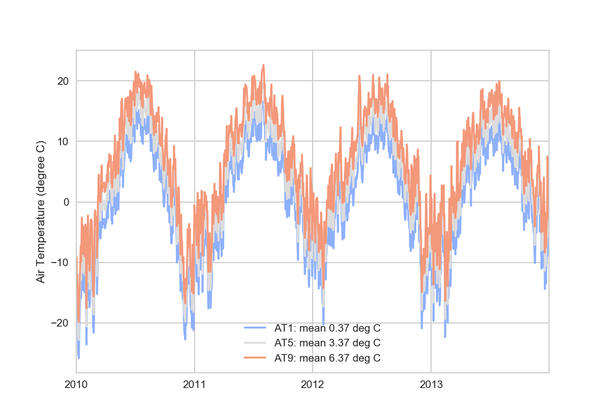
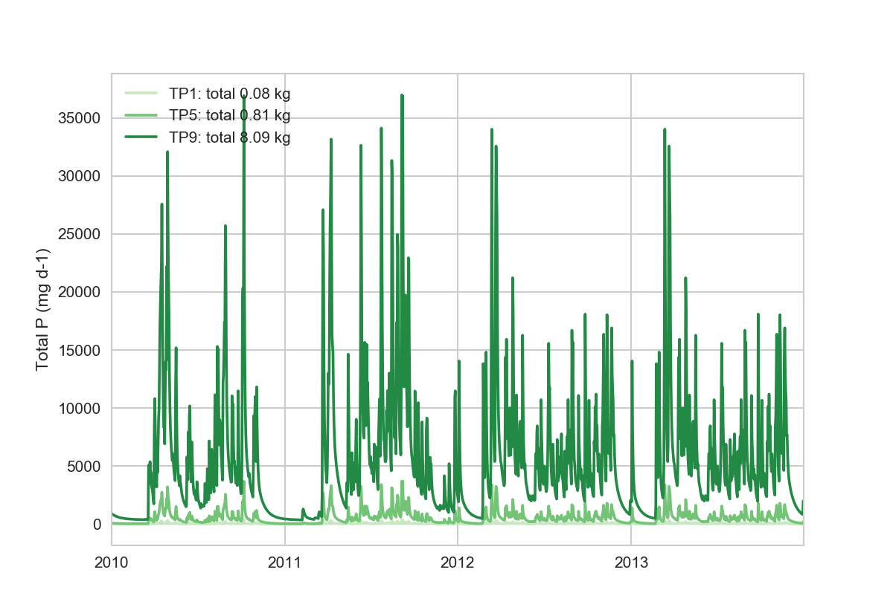

# How to run this simulation

1. Preparation. Review makeparameterdict.R and makeMLfiles.R and run
   them in that order. This will populate the input files and create
   directories for the outputs. 
1. Run makebatch.py. This will create batch .m files.
1. Run the batch files made in the previous steps. Use Raoul's
   launch__24__batch.m if appropriate. 
1. Postprocessing files are in [postprocessing](postprocessing). Run
   pp.py and sim_specific in the directory. 

# What's new in Simulation 10

* Uses Igor's late February versions, except:
  * `dz = 0.5`
  * Ice output `His` outputs
* dimensions 9 by 9 by 9 by 9
  * with the base reference to be at 5 by 5 by 5 by 5
  * this base reference is not the original Langtjern weather, see
    table below

# Design

* Inputs taken from real Langtjern weather
  * with base being modified
  * all levels also modification of the original
  * 4 years (2010-2013)
* Simulation lasts 8 years (2010-2017)
  * repeats first 4 years twice
  * use the last 4 years (2014-2017) for reporting purpose
  * does that mean that water-sediment is in quasi steady state?
    * water part seem fine (short residence time ? days)
	* still don't know if the sediment is (and will ever be) in steady
      state with water
	* basically not tested but beyond our scope this time...?
* The levels control the scale of the inputs, called **dimensions**
  * Air temperature **AT**
  * Wind speed **WS**
  * Total P concentration **TP**
  * DOC concentration **DOC**
* The levels (1 though 9) are chosen so that
  * At the extremes the inputs are almost unrealistic but still
    interesting, and the model does not crash
  * At the base (5), the **responses** are about at the middle in
    scale
	  * makes sure that when keeping 3 dimensions at the base level 5,
        we can maximise the contrast (dynamic range) of the last
        dimension. For example, with levels AT1-AT9 but fixing WS5 TP5
        DOC5, none of the last three (WS5, TP5, DOC5) should not
        dominate how AT1-9 plays a role if any. 

## Levels

TO COMPLETE IN THE NEXT COMMIT

Level | Temperature | Wind speed | Total P | DOC
--- | --- | --- | --- | ---
1 | original - 3.0 | original * 0.25 | original * 0.33 | original * 0.0316 
3 | **original** | **original** | **original * 3.0** |  **original * 0.316** 

# Responses

* no. hypoxia days per year (at 3000 micro g L-1) (d y-1)
* no. anoxia days per year (at 3000 micro g L-1) (d y-1)
* mean annual maximum chl concentration at surface (micro g L-1)
* mean JJA chl concentration at surface (micro g L-1)
* mean annual ice cover duration (d y-1)
* mean JJ mixing depth (m from the surface)

## Model crashes

None this time

## Input time series (2010-2013)

<!-- # Raw outputs -->

<!-- ## impact of **T** -->

<!--   -->
<!--   -->

<!-- ## impact of **WS** -->

<!--   -->
<!--   -->

<!-- ## impact of **TP** -->

<!--   -->
<!--   -->

<!-- ## impact of **DOC** -->

<!--   -->
<!--   -->

## Response surfaces

