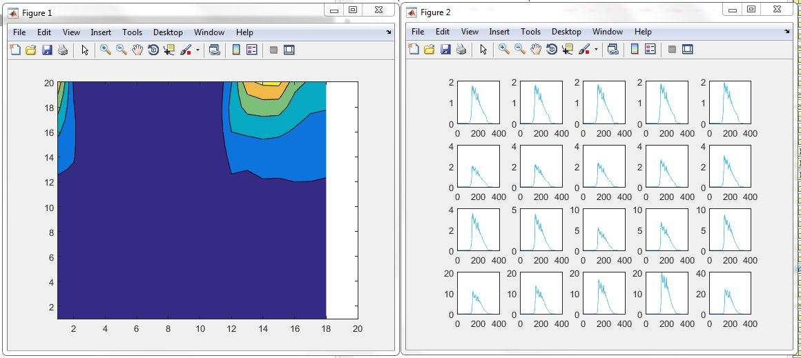
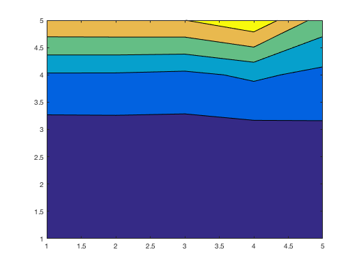
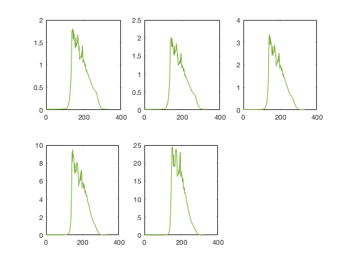

# We keep simulations and data in this folder

## input

data that goes into MyLake and submodules

## obs

observation data that can be compared with modelled results (measurements in-lake or lake water samples)

## 01 Raoul initial

scripts and results based on Raoul's initial work early 2016

## 02 5x5x5

Koji's exercise to get Raoul's script up and running; it has limitations in that it only uses pre-sediment version of MyLake

 
 

## 03 +Sediments

Added sediments (porting to MyLake2). 4 parameters. See [the folder](03_02plusSediments).
(Originally porting 02 to the version with Sediments
(solvemodel_v2.m))

## 04 5x5x5x5
Increased resolution. See [the folder](04_5x5x5x5). 

## 05 Fe
[The folder](05_Fe)
